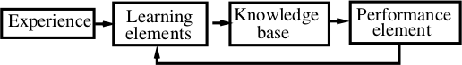

# CS36110 Machine Learning


## Introduction

Should really be known as Intelligent Learning.

Taught by:

* Younghuai Lio (yyl)
* Chuan Lu (cul)

Occam's Razor states that simple solutions tend to be better, however there are complex problem to which a simple solution simply isn't possible. Intelligent learning is the tool we use to help solve these complex problems.

> "Nothing is certain in this world other than death and taxes."

Experience is defined as an input-output pair, to which the input is the environment and the output is the decision.


### What is Learning?

A learning system is a computer program that makes decisions based on the accumulated experience contained in successfully solved cases.

Learning is improving performance $P$ with experience $E$ at some task $T$.


### A Learning Model




### Representation

Training Experience $<input, output>$

The $input$ consists of a pattern (input vector, patter vector, feature vector, sample, example or instance) of observations and the corresponding correct outputs.

Each attribute can take one of three types of value:

* Real Value
* Discrete Value
* Categorical Value

The $output$ can take two types of value:

* It may be a real number, in which case the learning algorithm is know as a function estimator, the $output$ is called an output value or estimate.
* It may be a categorical value, in which case the learning algorithm is known as a classifier, a recogniser or a categoriser, and the $output$ itself is a label, a class, a category or a decision.

If the $output$ is given the learning is known as **supervised**, otherwise it is **unsupervised**.


### Target Functions

The relationship $f$ between the learning inputs $x$ and outpus $y$ is:

$$
y = f(x)
$$

In practice we have no idea what $f$ actually is, but we can make an assumption about what $f$ looks like with a hypothesis $h$.

$h$ will be learned from the training examples and some sort of algorithm.


### Learning as Regression

Given experience: $<input, output>(i=1,2,...)$

Define a target function $h: input \rightarrow output$

Choose learning criterion: The target function should best fit the experience.

Optimise the objective function:

$$
min_h\sum_i(\overset{\^}{output_i} - output_i)^2
$$

**In English:** Minimise $h$ for the squared distance between the output of $h(x_i)$ and $y_i$ of all examples.


### Performance Measurement

$$
\text{Error Rate} = \frac{\text{Number of Errors}}{\text{Number of Examples}}
$$


## Learning

Knowledge is gained through learning from experience. Normally to apply knowledge we have to makes some form of assumtions, we call this bias in IL. Therefore our knowledge is not always correct.

We can learn from both sucess and failure.

Learning is an abstract process, we cannot formalise how we as humans actually learn.


### AI Systems

The advantages of this are as follows:

* This is often more accurate than humans.
* Humans are often incapable of expressing the result.
* Automatic method to search for the hypothesis explains the data.
* Cheap and flexible.

However the downsides are that:

* There is a need for a lot of labelled data.
* Error-prone and inheritantly imperfect.
* Difficult to discern what has actually been learnt.

One important tennant of IL is that data is cheap and abudant, but knowledge is rare and expensive. Thus learning from examples is the most common form of learning.

To have achived learning you must improve the performance of the system in some way.

The training data takes the form of an input:output mapping. The input is usually some form of vector and the output can take the form of a real, discrete or categorical value.

If 
$$output \in R$$
then the algorithm is ??? (I turned off here).

Learning is supervised is the output of the training data is known.


### Definitions

We define this experience in the form

$$y = f(x)$$

Where: $y$ is the outcome and $x$ is the parameters. We use $f$ to map $x$ to $y$. $f$ is usually unknown as it is the aim for learning.

We guess $f$ using hypotheses $H$. Each hypothesis $h$ is an approximation of $f$ from the training data in various methods (e.g. Expectation Maximisation, Optimisation, etc.).

Give expereicence $<1:0>(i=1,2,...)$ we define a target $h:1 \rightarrow 0$. We then optimise the objective function:

$$\min\sum(O^^_i - O_i)$$

Where $O^^$ is the actual output and $O$ is the desired output.

TODO graph here.

In the above graph $h1$ accounts for noise. $h2$ is accurate if the training data is known not to be noisy. Both of these require some form of prior knowledge of the data set.


### Performance

The error rate is defined as:

$$E = e \div p$$

Where $E$ is the error rate, $e$ is the errors and $p$ is the predictions.

The *Apparent error rate* is the error rate of all tested data.

The *Test sampe error rate* is the error rate when trained with a large fraction and tested with the remaining data.

The *True error rate* is the error rate when trained with all existing data and tested with new data.

True error is preferred out of all three, but is the most difficult to perform.

##Concept Learning

Induce a description of a concept from a set of specific examples.

Example: inferring a Boolean function from given inputs and outputs.

### Notation and Terms

* $x$ - Instance Space (constraints).
* $c$ - Target Concept (to be learned).
* $<x, c(x)>$ - Training examples $D$.
* $H$ - Hypothesis space.
* $h$ - A single hypothesis where $h \in H$.
* $X: h:X \rightarrow \{0,1\}$

Learning goal is to find a $h$ to satisfy:

$$h(x) = c(x) for all in D$$

* $?$ indicates any value is acceptable (wildcard).
* $0$ indicates any value is unacceptable (garbage state).

$h$ is a conjunction of constaints.

For example:

$$h = {math=difficult, workload=hard, presentation=dull, application=?, references=?} \rightarrow 0$$

Concept learning can be defined as a search.

* Theoretical: $2^\{|H|\} - 1$
* Syntatian: $\prod_i x + 2$ (includes $?$ and $0$).
* Semantical: $1 + \prod_i x + 1$ (includes $?$ and $0$ as single states).

### Ordering of H
$x$ satisfies $h$ iff $h(x)=1$.

$h_{i}$ generalised to $h_{j}$

$h_{j}$ specialised to $h_{i}$

### Rote Learning
Rote learning is the a form of learning where you only give answers to instances which pre-exists in the training data. You cannot classify a completely an instance if there is no exact match in the data set.

### FIND-S

```
init h to be the most specific in H
for each positive training instance in x:
  for each constaint a[i] in h:
    if a[i] satisfied x:
      do nothing
    else
      replace a[i] by next most specific example satisfied by x
return h
```

For example:

$$h_0 = <E, L, I, W, R>$$

$$x_1 = <M, L, I, W, R>$$

$$h_1 = <?, L, I, W, R>$$

$$x_2 = <E, H, I, N, R>$$

$$h_2 = <?, ?, I, ?, R>$$

Only works when:
* $f \in H$
* No errors in training data.
* $H$ are confunctions

Problems:
* May not converge on a correct $h$.
* Can't detect inconsistencies.
* Picks maximally specific $h$.
* There may be several $h$.


### Candidate Elimination
Finds all describable $h$ if $h$ is consistent with $D$ iff $h(x) = c(x)$ for $<x, c(x)> \in D$

$$
consistent(h,D) \equiv (\forall <x,c(x)> \in D) h(x) = c(x)
$$

Version space:

$$
VS_{H,D} \equiv \{h \in H | consistent(h,D)\}
$$

(Most) Specific $\rightarrow$ (Most) General are the only required $h$, others can be generated from these two.


### List-then-Eliminate

```
VS = H

for(<x, c(x)>):
  remove h if h(x) != c(x)

output VS
```

Guarentees all H consistent, required to enumerate all in H.


### Induction Bias
$L$: Convept Learning als[sic?]

$X$: Instance space.

$c$: Target function.

$D_{L} = {<x,c(x)>}: Training data.

$$
D_{i}: (\forall x_{i} \in X)[(B \cap D_{i} \cap x_{i}) \vdash L(x_{i}, D_{i})]
$$

For reference:

$A \vdash B$: $A$ entails $B$.
## Decision Tree Learning
Easiest and most powerful algorithms.

Nodes test an attribute, leaves are a classification, edges correspond to an attribute value.

Can use set notion to represent a decision tree.

$A \cap B$ -> Image here.

$A \cup B$ -> Image here.

Can represent any boolean function.

### Top-Down Induciton
```
node = root
main loop:
  A <- 'best' decision attribute for next node.
  Assign A as decision attribute for node
  Sort E to leaf nodes
  if E perfectly classified or all attributes used:
    stop
  else
    iterate through leaf nodes
```

Problem is deciding the best decision for a node.

We apply Occam's Razor to this problem, that is the best solution is the best solution, in this case this means the best tree is the smallest possible to correctly classify elements.

The search we use to find a tree is a greedy hueristic where the main decision is for the next attributes.

We try to find the purest attribute to split on at the current point in the tree.

Example:

${(A=0, B=0), -}: 50$

${(A=0, B=1), -}: 0$

${(A=1, B=0), -}: 0$

${(A=1, B=1), +}: 100$

Splitting on $A$ in this example gives pure labels (I think I copied this down wrong). Splitting on $B$ doesn't.


### Entropy

$S$ -> Training data

$p_+$ -> Positive examples in $S$

$p_-$ -> Negative examples in $S$

$Entropy(S) = - p_+ log_2(p_+) - p_- log_2(p_-)$

Baring in mind that $p_- = 1 - p_+$

The least pure is $p_+ = 0$

More generally:

$Entropy(S) = \sum_i(-p_i log_2(p_i))$


### Information Gain

$Gain(S,A)$ is the expected reduction of Entropy due to sorting on $A$.

$Gain(S,A) = Entropy(S) - \sum_{u \in Values(A)}\frac{|S_u|}{|S|}Entropy(S)$


### ID3

```
create root node
if all labelled same return single node with an attribute
	A = best att for S
	root = A
```


### Overfitting

$error_{train}(h) < error_{train}(h')$

$error_D(h) > error_D(h')$

Stop growing tree when split is not statistically significant.

Post-prune overfitting.

"Post" tree: $min(size(tree)+size(misclassifier(train)))$ (where min is the minimal description length [whatever the fuck that is])


### Continuous Attributes

Choose cut-off values (like in fuzzy?)


### Attributes with many values

Use Gain Ratio:

$GainRatio(S,A) = \frac{Gain(A,S)}{SplitInfo(S,A)}$


### Attributes with costs

$\frac{Gain^2(S,A)}{Cost(A)}$

$\frac{2^{Gain(S,A)} - 1}{Cost(A) + 1}$


### Attributes with missing values

Assign the most common, classify new examples in a similar fashion.


## Regression

### Bias and Variance 

Bias $\approx$ Systematic Error

Variance $\approx$ Error due to the varaiability of the model.

Bias $\rightarrow$ Underfitting $\rightarrow$ Hypothesis insufficient (in hypothesis space).

Variance $\rightarrow$ Overfitting $\rightarrow$ Hypothesis inacurate for unseen data (large hypothesis space).


### Linear Regression

$h(x) = w_0 + w_1x$

$min(\sum_i(y_i - h(x_i))^2)$

Effectively minimize the squared errors.


### Bias - Variance Analysis

Given new data $x^*$

Expected predicted error is $E_D((y^*-h(x^*))^2)$

Decompose into bins variance and noise.

$E_D((h(x^*) - \bar{h}(x^*))^2)$ $\rightarrow$ Variance

Where $\bar{h}(x^*) = E_D(h(x^*))$

$(\bar{h}(x) - f(x^*))^2$ $\rightarrow$ Bias

Where $f(x^*)$ is the true target.

$E_D((y^* - f(x^*))^2)$

Expected prediction error $=$ Variance $+$ Bias $+$ Noise


###Formal Definitions

$Variance = E_{x,D}((h(x) - \bar{h}(x))^2)$

$Bias = E_X((\bar{h}(x) - f(x))^2)$

$Noise = E{\epsilon, x}((y-f(x))^2) = E(\epsilon^2) = \sigma^2$


### Hypothesis Space

Decreasing bias increases the hypothesis space (and therefore variance)

Increasing bias decreases variance.

You should match modle complexity to data resouces.

Decision trees have a high variance in general due to thei hueristic nature.

**Note:** Bias is not Inductive Bias. They are, however, linked.


### Ensemble Models

Ensemble models involves combining the preditions of several models to improve overall performance.

### Intuitions

Combining diverse, inderpendant opinions.

Protective mechanism.

Majority vote.

### Boosting

Grow models sequentially, make misclassified examples important.

Decreases bias mainly.

### Bagging

Use different samples.

Decreases variance mainly.


### Bagging - Bootstrap Aggrigation

More robust to noise.


### Random Forest

Applying Bagging to the decision tree and attributes.
## Artificial Nueral Networks

### Linear Classification

$h(\vec{x}) = sign(x)$

Uses an absolute threshold (e.g. binary).


### Linear Regression

Apply a linear function.

$h(\vec{x}) = s$


### Logistic Regression

Apply a 'soft' threshold (like a sigmoid function).

$h(\vec{x}) = \theta s$


### Perception

A type of ANN.

$(x_0, x_1, ..., x_d) = \vec{x} \rightarrow inputs, \vec{w} \rightarrow weights$

$$
o(\vec{x}) = \left\{ 
  \begin{array}{l l}
    1 & \quad \text{if} \vec{w} \vec{x} > 0\\
    -1 & \quad \text{otherwise}
  \end{array} \right.
$$

$$
\sum^d_iw_ix_i = \vec{w}\vec{x}
$$

This can represent a logical function, e.g.: $x1 \&\& x2$

But can't represent some, e.g.: XOR.

$$
h(\vec{x}) = sign( \sum^d_i{w_i x_i} ) = sign(\vec{w}\vec{x})
$$

Each run pick a misclassified example:

$$
sign(\vec{w}\vec{x}^{(n)}) \neq y^{(n)}
$$

Update weight:

$$
\vec{w} \leftarrow \vec{w} + y^{(n)}\vec{x}^{(n)}
$$

```
until no misclassified results:
	pick misclassified result
	update weight
done
```

Modified

$$
\Delta\vec{w} = \eta(y-o)\vec{x}
$$

$o \rightarrow$ Perception output.

$\eta \rightarrow$ Small constant (learning weight).

Can be proved to converge with a linearly seperable data set and learning rate which is sufficiently small.


### Linear Regression

Target function $f: \vec{x} \rightarrow y \in \mathbb{R}$

$$
h(\vec{x}) = \vec{w}\vec{x} \text{ that approximates } f(\vec{x})
$$

By minimising

$$
E(\vec{w}) = \sum^{N}_{n-1}((\vec{w}\vec{x}_n)-y_n)^2
$$

$$
\nabla E(\vec{w}) = \frac{\partial E(\vec{w})}{\partial\vec{w}} = 2 \sum^{N}_{n-1}((\vec{w}\vec{x}_n)y_n)^2 \vec{x}_n = 0
$$

$$
\vec{w}^* = (\frac{1}{N}\sum^{N}_{n-1}\vec{x}_n\vec{x}_n)^{-1}(\frac{1}{N}\sum^{N}_{n-1}\vec{x}_n y_n)
$$


### Logistic Regression

$$
\theta(s) = \frac{e^s}{1 + e^s} = \frac{1}{1+e^{-s}}
$$

$$
h(\vec{x}) = \theta{s} \text{ can be interpeted as } P(x)
$$

e.g.:

$$
P(y|\vec{x}) = \left\{
  \begin{array}{l l}
    f(\vec{x}) & \quad \text{for } y = 1\\
    1 - f(\vec{x}) & \quad \text{for } y = -1
  \end{array} \right
$$

Learn:

$$
s(\vec{x}) = \theta(\vec{w}\vec{x}) \approx f(\vec{x})
$$

Error Measure:

For $(\vec{x}, y)$ $y$ is generated by $f(\vec{x})$.

If $h=f$, how likely to get $y$ from $\vec{x}$

$$
P(y|\vec{x}) = \left\{
  \begin{array}{l l}
  h(\vec{x}) & \quad \text{for } y = 1\\
  1 - h(\vec{x}) & \quad \text{for } y = -1
  \end{array} \right
$$

Likelyhood:

Substitute $h(\vec{x})$ for $\theta(\vec{w}\vec{x})$

Where $\theta(-s) = 1-\theta(s)$

$$
P(y|\vec{x}) = \theta(y\vec{w}\vec{x})
$$

Likelyhood of $D=<\vec{x}_1, y_1>, ..., <\vec{x}_N, y_N>$ is

$$
\prod^{N}_{n=1} P(y_n|\vec{x}_n) = \prod^{N}_{n=1}\theta(y_n \vec{w} \vec{x}_n)
$$

For convenience we change $max(likelyhood)$ to:

$$
min(\frac{-1}{N}ln\prod^{N}_{n=1}\theta(y_n \vec{w}\vec{x}_n))
$$

Simplify to:
$$
\frac{1}{N}\sum^{N}_{n=1}ln(\frac{1}{\theta(y_n\vec{w}\vec{x}_n))
$$

### Gradient Descent

```
start a W(0)
step down steepest slope
fixed step size W(1) = W(0) + step_size * direction
```

Mathematically:

$$
W(1) = W(0) + \eta v
$$
## Revision Session

### Support Vector Machines

> "Understand principal of SVMs, but not the maths."

Concepts important. Formulas are not that important - show figures and show understanding - hyperplanes. Training examples - support vectors are just examples with a special hyperplane. One degree of freedom of SVMs.

Linear classifier. Maximise the margin between examples.

SVMs essential try to achive two ideas: maximise the margin, minimise the error. Different from other learning algorithms.

Suppose given kind of hyperplane: $ax + by + cy + d = 0$: What is the margin, remember formula, apply formula.

In this case: $m = \frac{2}{||W||}$

Distance if $(x,y,z)$ is: $D = \frac{ax + by + cy + d}{\sqrt{a^2+b^2+c^2}}$

We can change so that $ax + by+cz +D = \pm1$ easily as the norm doesn't change.

Each question probably contains 3 parts:

* Basic Concepts
* Theories, concepts
* Application

For all other mathematical formulas we aren't expected to know every single detail. SVM are special because there are some simple maths.

Choose **3** from **4** questions.


### Non-linear SVM

> "We're not touching on non-linear SVMs?"

No, it was removed from the sylabus. It's much simpler but the principals are similar.

**Draw figures, write explanations.**


### Past Papers Model Answer

> "Past exam question 1 (monkey and bannana is learning?), what's a model answer for this?"

Something discussed in the slides. The learning process - monkey learns process to achieve goal.

Younghai is quite flexible, so long as the answer is reasonable and well justified then it will get marks :).


### FIND-S

> "You have some attributes, $a,b,c$, and some examples. Start with the most specific (non are acceptible). $a$ is then acceptible in the first example, $b$ is then acceptable in the second. How do you write this down without including $c$?"

You'll just have to generalise from $a$ to $?$. In practice you can introduce some other notiations. You have to make a trade off between the simplicity or the compututional complexity, etc.

Concept learning is, of course, very basic.


### Maths of ANN

> "Know weights are adjusted every time, not sure how it happens."

Use some diagram or graph to help. Nodes in all layers, initialise all weights. Given the inputs, you can always calculate the outputs. Compare output against real output. In this case you can just change the direction of a network.

First go from input to output, then propergate the error back to the inputs.

Input and output is not linear $\rightarrow$ first order derivative of the sigmoid function.

Seems complicated, once you know the ideas, it's actually quite easy to work out formulas.

Nice property:

$$
\frac{\partial \text{damnit he moved on to quic}}{...} = (\sigma(?))(1-\sigma(?))
$$

For an output node the error is:

$$
\delta = O(1-O)(T-O)
$$

For a hidden node the error is:

$$
\delta = O(1-O)Error-contribution
$$

Where $Error-contribution$ is the weighted sum of errors of the nodes to which it is connected in the next layer.

Small random initialisation values are very small (depends on the applicaton). Normally around 0.


### Past Paper Party Question


Wanted to see something about the constraints. Something like **when**, **purpose**, **where**, etc. How to describe such situations using some attributes or features.


### Cross Validation

> "How do you go about performing cross-validation?"

Split the data set. Training and testing set.


### Golden Standard

> "What is the golden standard?"

Usually 2 thirds for training, 1 third for testing. Depends on situation.


### Confusion Matrix

> "What is a confusion matrix?"

True positive, false positive, false negative, true negative.


### Topics of the exam

> "What's on the exam?"

* Introduction, concept learning
* SVM (concepts and computations) and a little on Reinforcement Learning (emphasis ideas, difference to other learning techniques).
* ??
* ??

IID: Identically, Inderpendetly, Distributed. In this case, one example should not be affected by another. All examples follow some sort of single distribution.

Collect evidence showing understanding. Encoraged to write as much as possible, even if you're not sure which is the right answer. **WRITE SOMETHING**. Read questions carefully ;).

Getting part a wrong does not imply part b.

If you know the formulas, write it down and explain it. If you don't, use words to describe the process.

Average mark is around 50% from last year. Normal is around 55%. Hopefully better this year :).


### Concept Learning again

> "How do you work out symatically different hypotheses?"

Constraints: $a: a_1, a_2, a_3$, $b: b_1, b_2$, $c: c_1, c_2$ and special cases: $?, \emptyset$.

$a: 5, b:4, c:4$

Possibilities not including special cases.

$$
3 \times 2 \timez 2 = 12
$$


Syntatically.

$$
5 \times 4 \times 4 = 80
$$ 

However as soon as $\emptyset$ is included, it is always negative.

$\therefore$ Symatically:

$$
4 \times 3 \times 3 + 1 = 37
$$

Ideal hypotesis space:

$$
2^n \text{ where } n = a_n \times b_n \times c_n
$$


### Bayesian Learning

> "Difference between MAP and ML?"

ML assume all different hypothesis are equally likely, for MAP not all equally likely.

Naive Bayes classifier -> Estimated probabilities. Encoraged to work these out from given training examples.
